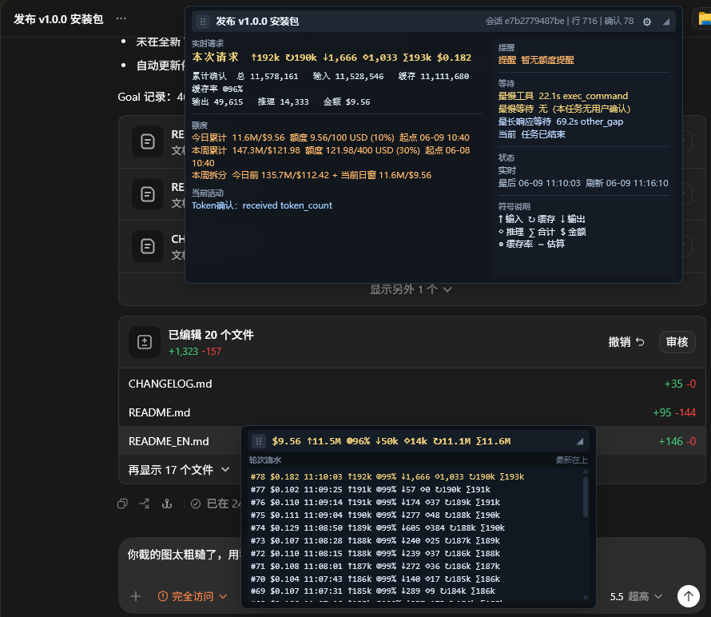
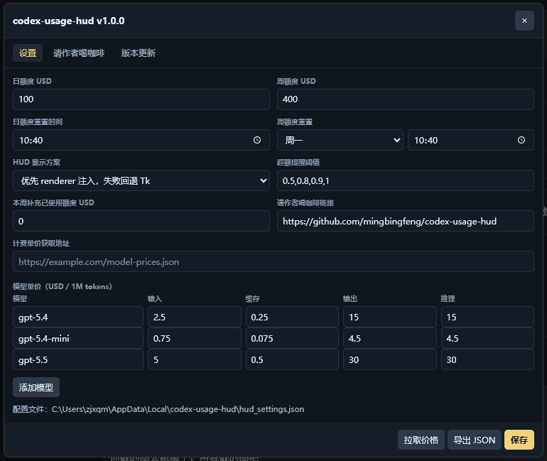
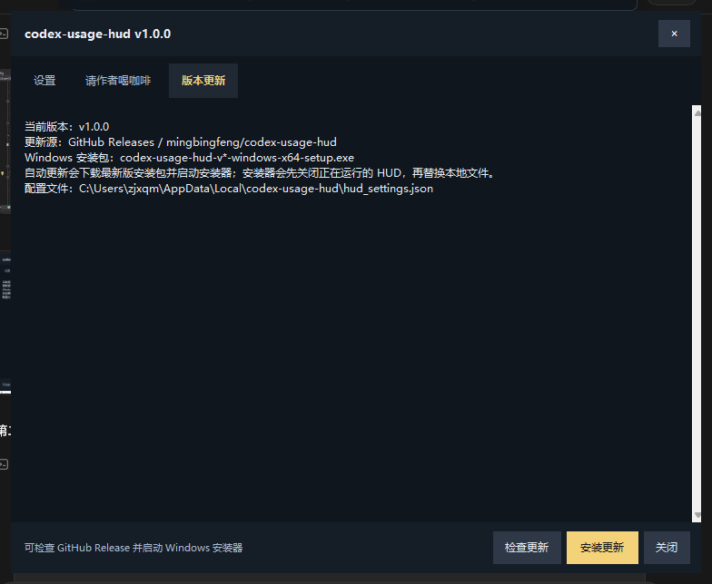

# codex-usage-hud

中文 | [English](README_EN.md)

[](https://github.com/mingbingfeng/codex-usage-hud/releases)
[](LICENSE)
[](https://github.com/mingbingfeng/codex-usage-hud/releases)
[](pyproject.toml)

`codex-usage-hud` 是面向 Codex App 的本地实时用量 HUD。它读取本机 Codex JSONL / SQLite 日志，在 Codex 界面或 Tk fallback 窗口里显示当前会话 token、缓存命中率、实时金额、日/周预算和等待状态，不上传任何会话内容。

## 快速使用

从 [GitHub Releases](https://github.com/mingbingfeng/codex-usage-hud/releases) 下载最新版 Windows 安装包：

- Windows：`codex-usage-hud-v*-windows-x64-setup.exe`

安装后会有几个入口：

- `Codex Usage HUD`：后台 daemon 入口；如果 Codex App 未启动，会提示选择 Renderer 注入或 Tk 模式，并按所选模式拉起 Codex App。开机自启动入口会保持静默等待。
- `Stop Codex Usage HUD`：关闭正在运行的 HUD。
- `Check for Updates`：检查 GitHub Release 是否有新安装包。

也可以在命令行使用：

```powershell
codex-hud --once
codex-hud --daemon
codex-hud --stop
codex-hud --check-update
codex-hud --update
```

## 赞助商

[想显示在下方？](mailto:512145547@qq.com?subject=codex-usage-hud%20Sponsor)

| 赞助商 | 介绍 |
| --- | --- |

## 交流与支持

交流与支持：敬请期待。

如果这个 HUD 帮你节省了排查 token 和费用的时间，可以请作者喝杯咖啡，或者随手赞赏支持一下继续维护。

<p>
  
  
</p>

## 主要功能

- Renderer 注入优先：Codex 暴露本地 CDP target 时，HUD 直接显示在 Codex App 内部。
- Tk fallback：CDP 不可用时自动回退到本地 Tk HUD。
- 实时 token 与金额：输入、缓存输入、输出、推理、合计、缓存率和实时 USD 估算同屏展示。
- 日/周预算：自定义日额度、周额度、刷新时间、周起始日和提醒阈值。
- 工作状态观察：显示当前活动、最长等待、最慢工具和请求轮次流水。
- 本地配置：设置保存在当前用户 `hud_settings.json`，不需要云端账号。
- 自动更新：设置页和 CLI 都能检查 GitHub Release 并启动 Windows 安装器。
- Windows 安装包：v1.0.0 起提供 Inno Setup 安装器，创建开始菜单和可选桌面快捷方式。

## 痛点与解决

中转站 tokens 用量和计费不透明，最怕后台请求“偷跑”到很久才发现。`codex-usage-hud` 把当前会话、今日、本周用量和金额直接挂在 Codex 旁边，缓存命中率和估算金额也会同步显示，方便及时判断费用是否异常。



Codex App 执行长任务时，等待过程很容易变成盲等。HUD 会显示当前请求是否还在运行、最新刷新时间、最慢工具和最长响应等待，让你知道它是在工作、等待工具，还是已经需要介入。

不同用户的额度周期并不一样。你可以在设置里定制自己的日/周额度、刷新日期时间点、提醒阈值和本周补充额度，把第三方中转站、团队预算或个人限额统一映射到本地提醒里。



旧版脚本启动和关闭不够顺手。v1.0.0 提供 Windows 安装器、开始菜单入口、停止入口和更新入口，日常使用不再需要记一串 Python 命令。



原始日志分散在 JSONL、SQLite 和会话索引里，手动核对成本很费时间。HUD 会把这些本地数据合并成一个快照，并保留 CLI `--once` 入口，方便排查、截图前复核和自动化检查。

## 自动更新与安装包

v1.0.0 起，`codex-usage-hud` 通过 GitHub Release 发布 Windows 安装包：

- 安装包命名：`codex-usage-hud-vX.Y.Z-windows-x64-setup.exe`
- 构建脚本：`python tools/build_installer.py`
- 安装器：Inno Setup 6
- 默认安装位置：`%LOCALAPPDATA%\Programs\codex-usage-hud`

HUD 设置页的“版本更新”标签可以检查最新版并启动安装器；CLI 也提供：

```powershell
codex-hud --check-update
codex-hud --update
```

安装器会在替换文件前先运行 `codex-hud --stop`，避免旧 HUD 进程占用可执行文件。

## 数据位置

- Codex 会话日志：`~/.codex/sessions/`
- Codex SSE / 状态数据库：`~/.codex/logs_2.sqlite`、`~/.codex/state_5.sqlite`
- HUD 配置：`%LOCALAPPDATA%\codex-usage-hud\hud_settings.json`
- HUD daemon 日志：`%LOCALAPPDATA%\codex-usage-hud\daemon.log`
- 默认安装目录：`%LOCALAPPDATA%\Programs\codex-usage-hud`

## 常见问题

### 以前的 v0.x tag 还能用吗？

`v0.1.0`、`v0.2.0`、`v0.3.0` 保留为历史 alpha / preview tag，不再作为推荐安装入口。`v1.0.0` 是第一个受支持的 Windows 安装包版本。

### HUD 没有出现在 Codex 里

先确认是从 `Codex Usage HUD` 或 `codex-hud --daemon` 启动。手动启动且未检测到 Codex App 时，HUD 会提示选择 Renderer 注入或 Tk 模式；Renderer 会尝试以调试/CDP 模式拉起 Codex App，并持续等待/重试 Renderer 注入；Tk 会普通拉起 Codex App 并打开独立窗口。如果 Windows 阻止直接启动，可能会出现一次权限确认。开机自启动使用 `--no-startup-prompt`，不会弹出选择框。

### 会上传我的提示词或日志吗？

不会。项目只读取本机日志和数据库，不做遥测、不上传 prompt/response，也不要求云端账号。提交 issue 前请阅读 [docs/PRIVACY.md](docs/PRIVACY.md)。

## 开发

```powershell
python -m compileall -q src tools tests
python -m unittest discover -s tests
python tools/build_exe.py
python tools/build_installer.py
```

主要结构：

```text
src/codex_usage_hud/
  cli.py                 CLI、daemon、更新命令入口
  daemon.py              Windows Codex 进程监听
  ui/renderer_hud.py     Codex renderer 注入 HUD
  ui/tk_hud.py           Tk fallback HUD
  updater.py             GitHub Release 更新检测与安装器启动
tools/
  build_exe.py           PyInstaller 单文件 exe 构建
  build_installer.py     Inno Setup 安装包构建
  installer/             Inno Setup 脚本
tests/                   解析、UI、daemon、打包和更新回归测试
```

## 说明

`codex-usage-hud` 是外部本地监控工具，不修改 Codex App 原始安装文件。Codex App 或日志格式变化后，可能需要更新解析和 renderer 注入逻辑。
