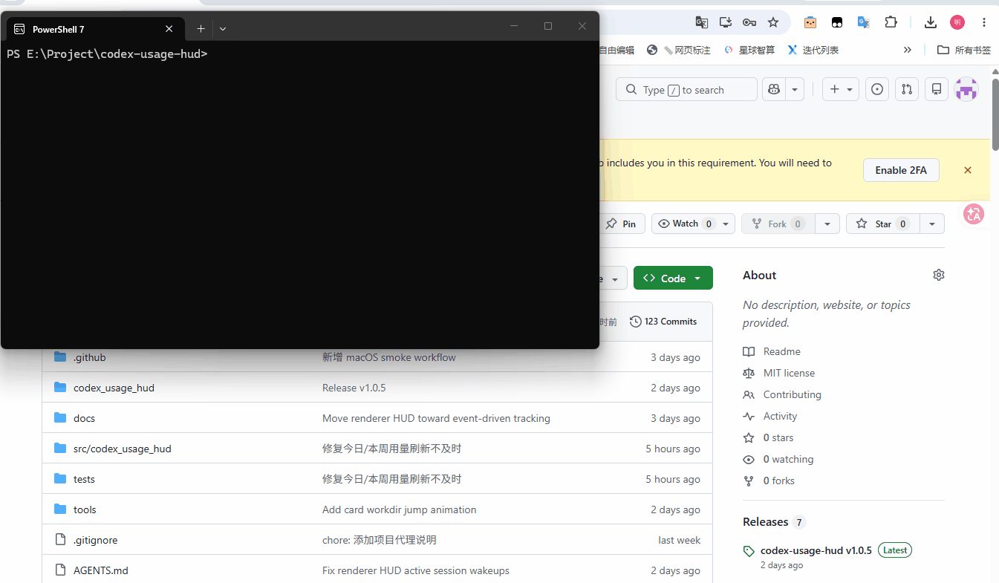
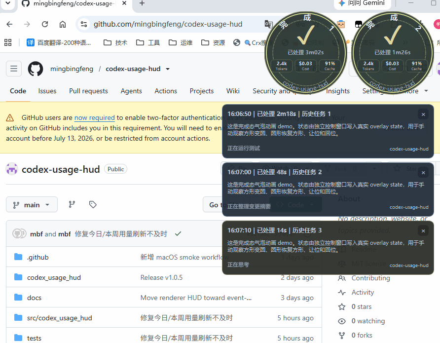
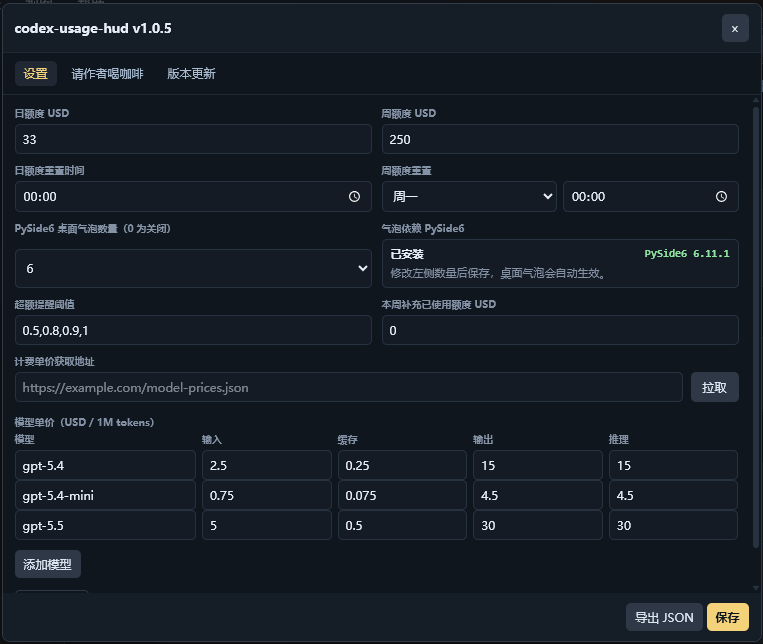

# codex-usage-hud

中文 | [English](README_EN.md)

> **在 Codex App 里实时看到 token 消耗、缓存命中率和真实花费 —— 纯本地运行，不上传任何会话内容。**
> 专治中转站用量「偷跑」和长任务盲等。

[](https://github.com/mingbingfeng/codex-usage-hud/releases)
[](LICENSE)
[](https://github.com/mingbingfeng/codex-usage-hud/releases)
[](pyproject.toml)
[](https://github.com/mingbingfeng/codex-usage-hud/stargazers)

`codex-usage-hud` 直接把用量面板注入 Codex 界面（renderer 注入，不是另开窗口）：当前会话 token、缓存命中率、实时 USD 估算、日/周预算、等待状态一屏可见。所有数据只读取本机 Codex JSONL / SQLite 日志，**无遥测、不上传 prompt/response、不需要云端账号**。

### 为什么需要它
- 💸 **成本透明，防偷跑** — 中转站计费不透明，后台请求容易悄悄跑很久才发现。HUD 把当前/今日/本周用量和金额挂在 Codex 旁边，异常一眼看出。
- ⏳ **长任务不盲等** — 实时显示请求是否在跑、最慢工具、最长等待，知道它在工作还是该介入了。
- 🔒 **隐私优先** — 纯本地，零遥测，代码开源可审计。

## 快速使用

从 [GitHub Releases](https://github.com/mingbingfeng/codex-usage-hud/releases) 下载最新版 Windows 安装包：

- Windows：`codex-usage-hud-v*-windows-x64-setup.exe`

安装后会有几个入口：

- `Codex Usage HUD`：后台 daemon 入口；如果 Codex App 未启动，会以固定调试/CDP 端口拉起并注入 renderer HUD。若已运行的 Codex 未启用 CDP 或端口不匹配，右上角启动面板会等待用户点击“重启 Codex”，不会自动打断当前工作。
- `Stop Codex Usage HUD`：关闭正在运行的 HUD。
- `Check for Updates`：检查 GitHub Release 是否有新安装包。

也可以在命令行使用：

```powershell
codex-hud --once
codex-hud --daemon
codex-hud --stop
codex-hud --check-update
codex-hud --update
```

## 赞助商

[想显示在下方？](https://github.com/mingbingfeng/codex-usage-hud/issues)

| 赞助商 | 介绍 |
| --- | --- |

## 交流与支持

有问题、建议或想交流，欢迎去 [GitHub Issues](https://github.com/mingbingfeng/codex-usage-hud/issues) 发帖，我会持续跟进。

## 主要功能

- Renderer-only：Codex 暴露配置的本地 CDP target 时，HUD 直接显示在 Codex App 内部；CDP 不可用或端口不匹配时在右上角启动面板提供一次显式重启入口，不自动重启，也不回退到 Qt/Tk 独立窗口。
- PySide6 桌面会话气泡：源码 / pip 安装时可通过 `codex-usage-hud[desktop-overlay]` 启用桌面级方形运行气泡和完成态圆气泡；主 HUD 仍保持 renderer-only。
- Codex 主题跟随：Renderer 模式优先跟随 live 主题；没有可用 CDP target 时会保留诊断，提示重新以调试端口启动 Codex App。
- 实时 token 与金额：输入、缓存输入、输出、推理、合计、缓存率和实时 USD 估算同屏展示。
- 日/周预算：自定义日额度、周额度、刷新时间、周起始日和提醒阈值。
- 工作状态观察：显示当前活动、最长等待、最慢工具和请求轮次流水。
- 本地配置：设置保存在当前用户 `hud_settings.json`，不需要云端账号。
- 自动更新：设置页和 CLI 都能检查 GitHub Release 并启动 Windows 安装器。
- Windows 安装包：v1.0.0 起提供 Inno Setup 安装器，创建开始菜单和可选桌面快捷方式。

## 痛点与解决

中转站 tokens 用量和计费不透明，最怕后台请求“偷跑”到很久才发现。`codex-usage-hud` 把当前会话、今日、本周用量和金额直接挂在 Codex 旁边，缓存命中率和估算金额也会同步显示，方便及时判断费用是否异常。



Codex App 执行长任务时，等待过程很容易变成盲等。HUD 会显示当前请求是否还在运行、最新刷新时间、最慢工具和最长响应等待，让你知道它是在工作、等待工具，还是已经需要介入。桌面气泡实时展示任务完成状态。



不同用户的额度周期并不一样。你可以在设置里定制自己的日/周额度、刷新日期时间点、提醒阈值和本周补充额度，把第三方中转站、团队预算或个人限额统一映射到本地提醒里。



旧版脚本启动和关闭不够顺手。v1.0.0 提供 Windows 安装器、开始菜单入口、停止入口和更新入口，日常使用不再需要记一串 Python 命令。


原始日志分散在 JSONL、SQLite 和会话索引里，手动核对成本很费时间。HUD 会把这些本地数据合并成一个快照，并保留 CLI `--once` 入口，方便排查、截图前复核和自动化检查。

## 自动更新与安装包

v1.0.0 起，`codex-usage-hud` 通过 GitHub Release 发布 Windows 安装包：

- 安装包命名：`codex-usage-hud-vX.Y.Z-windows-x64-setup.exe`
- 构建脚本：`python tools/build_installer.py`
- 安装器：Inno Setup 6
- 默认安装位置：`%LOCALAPPDATA%\Programs\codex-usage-hud`

HUD 设置页的“版本更新”标签可以检查最新版并启动安装器；CLI 也提供：

```powershell
codex-hud --check-update
codex-hud --update
```

安装器会在替换文件前先运行 `codex-hud --stop`，避免旧 HUD 进程占用可执行文件。

当前发行策略：

- 官方发布仍以 Windows 安装包为主，默认安装包不内置 PySide6 桌面气泡依赖。
- 需要桌面会话气泡时，当前推荐源码 / pip 环境安装 `codex-usage-hud[desktop-overlay]`。
- macOS 当前不发布安装包，只保留源码 / pip 路径和 `macOS Smoke` 代码级验证；详见 [docs/DESKTOP_OVERLAY_RELEASE_STRATEGY.md](docs/DESKTOP_OVERLAY_RELEASE_STRATEGY.md)。

## 数据位置

- Codex 共享数据根目录：`CODEX_HOME`（未设置时为 `~/.codex`）
- Codex 会话日志：`$CODEX_HOME/sessions/`
- Codex SSE / 状态数据库：`$CODEX_HOME/logs_2.sqlite`、`$CODEX_HOME/state_5.sqlite`
- 可选 SQLite 根目录：`CODEX_SQLITE_HOME` 或 config.toml 的 `sqlite_home`
- HUD 配置：`%LOCALAPPDATA%\codex-usage-hud\hud_settings.json`
- HUD daemon 日志：`%LOCALAPPDATA%\codex-usage-hud\daemon.log`
- 默认安装目录：`%LOCALAPPDATA%\Programs\codex-usage-hud`

设置里的“存储”页默认只显示本地元数据，并且只在用户点击“重新扫描”时工作。候选清理必须先生成 dry-run 预览、再二次确认；Codex 运行期间只会排队，不会自动结束任务。第一版只把过期且未被配置引用的临时 staging/clone 项列为 raw 清理候选，SQLite/WAL/SHM、JSONL 会话、插件运行时、凭据、配置、未知项和 reparse point 始终受保护。会话、插件和登录状态只能通过对应的官方 `codex archive/delete/plugin remove/logout` 动作管理。

## Codex 主题同步

HUD 现在支持跟随 Codex App 当前主题，包含浅色/深色区分和 `Copy theme`
分享字符串解析。实现方式、导出全部内置主题的方法和当前限制见
[docs/CODEX_APP_THEME_SYNC.md](docs/CODEX_APP_THEME_SYNC.md)。

## 常见问题

### 以前的 v0.x tag 还能用吗？

`v0.1.0`、`v0.2.0`、`v0.3.0` 保留为历史 alpha / preview tag，不再作为推荐安装入口。`v1.0.0` 是第一个受支持的 Windows 安装包版本。

### HUD 没有出现在 Codex 里

先确认是从 `Codex Usage HUD` 或 `codex-hud --daemon` 启动。HUD 使用一个固定的本地 CDP/debug 端口：未检测到 Codex App 时会直接以 CDP 模式拉起并连接；检测到已运行且端口匹配的 Codex 时会直接连接；若 Codex 未启用 CDP 或端口不匹配，右上角启动面板会显示“重启 Codex”按钮，只有点击后才会关闭并按第一种路径重新拉起。`--no-startup-prompt` 仅作为旧启动项的兼容参数保留，不再改变这三种启动路径。

### 桌面会话气泡没有显示

设置里的 `work_overlay_max_items` 表示 PySide6 桌面级会话气泡数量；设为 `0` 会关闭桌面气泡。未安装 `codex-usage-hud[desktop-overlay]` 时，renderer HUD 仍会正常运行，只会记录一次 `work_overlay_unavailable` 诊断。

### 会上传我的提示词或日志吗？

不会。项目只读取本机日志和数据库，不做遥测、不上传 prompt/response，也不要求云端账号。显式启用“存储”页的本地清理属于受保护的例外：它只接受 inventory 发出的 opaque item id，执行前会重验 revision、路径和锁定状态，且不会 raw 删除 JSONL/SQLite。提交 issue 前请阅读 [docs/PRIVACY.md](docs/PRIVACY.md)。

## 开发

```powershell
python -m pip install -e ".[desktop-overlay]"  # 可选：启用 PySide6 桌面会话气泡
python -m compileall -q src tools tests
python -m pytest
python -m pytest -m ui        # 可选：旧 Tk/Qt 模块的真实窗口回归
python tools/build_exe.py
python tools/build_installer.py
```

macOS 无本机验证路径：

- GitHub Actions `macOS Smoke` workflow 会在 `macos-latest` 上安装 `codex-usage-hud[desktop-overlay]`，并执行 lazy import、`compileall` 与任务相关 pytest。
- 这条 workflow 只覆盖代码级 smoke，不替代真实桌面交互验证；当前轮次不使用远程 Mac，因此 macOS 桌面气泡仍属于“待实机确认”。人工验证 checklist 见 [docs/MACOS_VALIDATION.md](docs/MACOS_VALIDATION.md)。

主要结构：

```text
src/codex_usage_hud/
  cli.py                 CLI、daemon、更新命令入口
  daemon.py              Windows Codex 进程监听
  ui/renderer_hud.py     Codex renderer 注入 HUD
  ui/work_overlay_qt.py  可选 PySide6 桌面会话气泡 helper
  ui/qt_hud.py           旧 Qt 独立窗口模块（默认不加载）
  ui/tk_hud.py           旧 Tk 独立窗口模块（默认不加载）
  updater.py             GitHub Release 更新检测与安装器启动
tools/
  build_exe.py           PyInstaller 单文件 exe 构建
  build_installer.py     Inno Setup 安装包构建
  installer/             Inno Setup 脚本
tests/                   解析、UI、daemon、打包和更新回归测试
```

## 说明

`codex-usage-hud` 是外部本地监控工具，不修改 Codex App 原始安装文件。Codex App 或日志格式变化后，可能需要更新解析和 renderer 注入逻辑。
